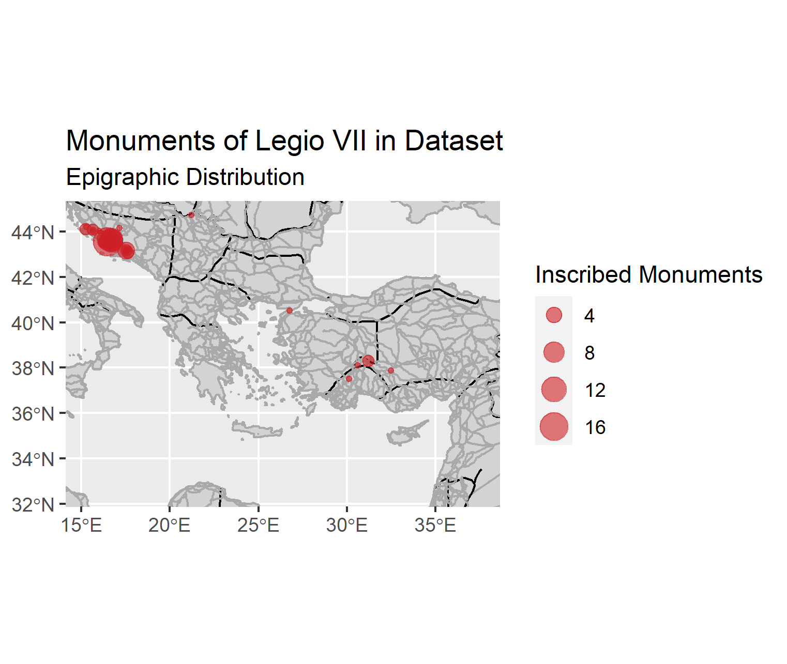

# Community and Identity in the Roman Seventh Legio:

**Digitally mapping funerary monuments referring to *Legio VII* servicemen and related members of the military community in Roman *Dalmatia***

_[CC BY-SA 4.0](https://creativecommons.org/licenses/by-sa/4.0/) E S Coopey_

## Authors:

-   Ewan Coopey (primary investigator),
    <https://orcid.org/0000-0001-8633-6418>; Research Assistant and
    PhD candidate, Macquarie University Department of History and
    Archaeology.

-   Dr Brian Ballsun-Stanton (data scientist);
    <https://orcid.org/0000-0003-4932-7912>; Solutions Architect
    (Digital Humanities), Macquarie University Faculty of Arts.

## Zenodo

v.1.0.0 
v.1.2.0

## Open Context Dataset

<https://doi.org/10.6078/M7X34VK8>

## Abstract:

This database was designed to facilitate and supplement
archaeological and epigraphical research conducted as part of a
Master of Research thesis submitted in December 2020. The project
builds upon and digitises the robust catalogic work of scholars
local to the modern region, such as Domagoj Tončinić's 'Monuments of
Legio VII in the Roman Province of Dalmatia'. This database stores
various types of geographical, epigraphical, visual, and historical
data related to Roman funerary and sacral inscriptions belonging to,
or commemorating, servicemen or veterans of the Roman Seventh Legion
(*Legio VII*) in the province of *Dalmatia* (the modern Eastern
Adriatic coastline and hinterland). This project, and the related
thesis '*Fratres Romani* in *Dalmatia*’, investigated the social
dynamics of *Legio VII*, as well as processes of identity and
community construction within the unit. It is hoped that this
dataset will facilitate future research into military life in
*Dalmatia*, as well as investigations of other corpora of Roman
funerary stelae, as the general form of the dataset is
transplantable onto epigraphical material from different regions of
the Roman world. This dataset was then analysed with R.

## Period

Early Roman Empire (30 BCE – 259 CE)

## Keywords
* Roman Empire,
* epigraphy,
* archaeology,
* Roman military,
* Dalmatia,
* monuments

## Potential Applications of the Data
The dataset has been
collated to facilitate further research into the seventh legion in
*Dalmatia* and their monuments. The structure of this dataset has
also been designed to best capture the types of epigraphical data
which are key for investigating the social dynamics of a Roman
community through their inscribed monuments, and it is hoped that
future researchers can adapt this database structure onto other
Roman epigraphic datasets.

## Support
This research was supported by the Croatian Studies
Foundation (CSF) 2020 Community, Culture and Research Scheme, and
the Macquarie University Research Excellence Scholarship
Scheme (MQRES).

## Related Publications
Coopey, E. S. (2020). ‘*Fratres* *Romani*
in *Dalmatia*: The Social Dynamics of *Legio VII* and the
Construction of Community and Identity through Roman Funerary
Monuments’, MRes Thesis, Macquarie University. Accessible via:
<http://hdl.handle.net/1959.14/1280183>

Coopey, E. S., and B. Ballsun-Stanton (2021). ‘Community and 
Identity in the Roman Seventh Legion’. _Open Context_. 
<https://doi.org/10.6078/M7X34VK8>.

Coopey, E. S., and B. Ballsun-Stanton (2023). 
‘Archaeo-Epigraphic Data Concerning the Community of Legio VII 
Servicemen in Dalmatia: A Dataset for “Fratres Romani in Dalmatia”’. _
Journal of Open Archaeology Data_, 11: 3. <https://doi.org/10.5334/joad.93>.

## Current Disposition of the Physical Collection
The monuments are either 1) lost, 2) in states of secondary use in
modern structures, or 3) are held in museums across Croatia and
Bosnia Hercegovina:
-   Arheološka zbirka Franjevačkog samostana u Sinju/Archaeological
    collection of the Franciscan Monastery in Sinj
-   Arheološka zbirka Marka Matijevića u Solinu/The Archaeological
    collection of Marko Matijević in Solin
-   Arheološki muzej u Splitu/Archaeological Museum in Split
-   Arheološki muzej u Zadru/Archaeological Museum in Zadar
-   Basilica of Santa Maria, Porto
-   Muzej Cetinske krajina/Museum of Cetina region
-   Muzej Triljskog kraja/Trilj Regional Museum
-   Muzej grada Trogira/Trogir City Museum
-   Muzej u Humcu (Franjevački samostan u Humcu)/Museum of Humac
    (Franciscan monastery of Humac)
-   Zemaljski muzej Bosne i Hercegovine/The National Museum of Bosnia
    and Herzegovina

## License

CC-BY-SA 4.0 International

## Map of files
(*descriptions in parentheses where required*)

`/BromansCoopey/`
-   `analysis/` (*example analysis csvs*)
-   `data/` (*data for this database in csvs*)
-   `DB-SQL/` (*files* *related to the database such as bibliogrpahies, the database, building/exporting shell commands*)
-   `original_source_data/` (*original data csvs*)
-   `thesis/` (*thesis which database is related to*)
-   `publication_files/` (*various files related to publication of this database to OCD <https://opencontext.org/>*)
-   `media/` (*proportional scale map outputs from r_scripts/*)
-   `r_files/` (*R scripts, data, shape files, and outputs)

## Methodological Notes

This database began with organising the epigraphic data catalogued in
Tončinić, D. (2011) *Spomenici VII. legije na području rimske provincije
Dalmacije / Monuments of Legio VII in the Roman Province of Dalmatia*.
The data concerning the monuments catalogued within this work was then
corroborated with that which available online on the EDCS
(<http://db.edcs.eu/epigr/epi.php?s_sprache=en>) and EDH
(<https://edh-www.adw.uni-heidelberg.de/>). Geographical data was then
sourced from Trismegistos (<https://www.trismegistos.org/geo/>),
Pleiades (https://pleiades.stoa.org/) and Google Maps
(https://www.google.com/maps), with archaeological and analytical data
sourced from various pieces of scholarly literature (for bibliography
see RIS/BIB in `DB-SQL/`). The aforementioned databases were also used to
find comparanda as well as source data concerning relevant monuments
which were not recorded in Tončinić (2011). When using online databases,
the primary means of navigation was through their linked open data,
however their search functions were also used with varying success.

The database has been roughly normalised to third normal form, even
though it is intended as an analytical database rather than a
transactional database. Data was hand-entered through automatic
shell-scripted conversion of CSV datafiles with no intentions of
supporting a front-end application. As such, no lookup tables were
constructed. Views were created to strongly differentiate analytical
outputs from the data sources they drew upon. Better constrained
vocabulary enforcement, more thorough annotations with linked open data,
and a more robust geospatial layer are all intended improvements for
future iterations of this database as time and technology permits.
Version control was used from the start, and this paper describes the
version at release 1.0.0.

Data was not always taken from online sources ‘as is’ and was assessed
for accuracy where appropriate. For instance, personal judgements were
made about the dating provided for certain monuments on online, as were
certain pieces of geographic data. Sometimes, the author would contact
the authors/organisers of the online resource with suggested changes.

Since late 2022, R has been used to conduct statistical analyses, as 
well as to plot, map, and visualise the corpus. Outputs for publications 
were also created using these.

## File metadata

- **Table Field Descriptions:** Provided in `data/README.md` and
    `analysis/README.md`.
- **Provide “Keys”:** Provided in `data/README.md` and
    `analysis/README.md`.
- **Controlled Vocabularies (“Standards”)**: Provided in
    `data/README.md` and `analysis/README.md`.

## Data sources
Roman provincial shape files in /r_scripts from <http://awmc.unc.edu/awmc/map_data/shapefiles/cultural_data/political_shading/roman_empire_ad_69_provinces/>
